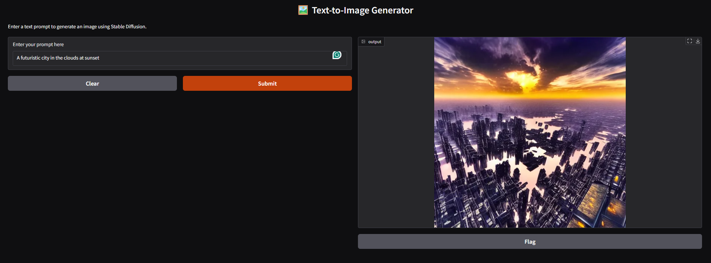
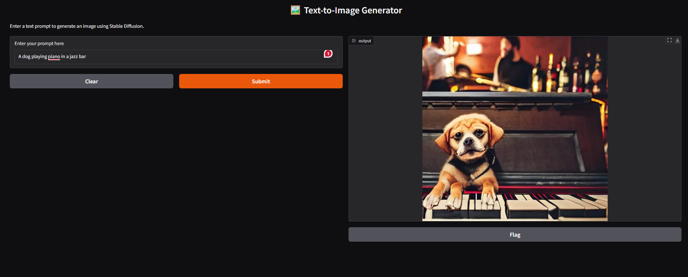
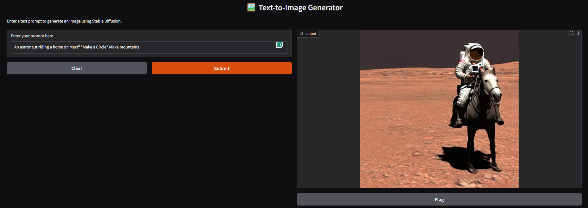

**🖼️ Text-to-Image Generator**

A simple web-based app that generates realistic images from text prompts using the Stable Diffusion v1.5 model. The interface is powered by Gradio and runs on GPU using PyTorch.

---

**🚀 Features**

- Generate high-quality images from any text description  
- Interactive UI built with [Gradio](https://gradio.app/)  
- Uses `runwayml/stable-diffusion-v1-5` from Hugging Face `diffusers`  
- Optimized for GPU (torch.float16 + CUDA)  
- Lightweight and easy to deploy  

---

**📸 Example Prompts**

> "A futuristic city in the clouds at sunset"  
> "A dog playing piano in a jazz bar"  
> "An astronaut riding a horse on Mars"

---
**🖼 Sample Outputs**

<p align="center">
  
  <br>
  <b>Figure 1:</b> A futuristic city in the clouds at sunset
</p>

<p align="center">
  
  <br>
  <b>Figure 2:</b> A dog playing piano in a jazz bar
</p>

<p align="center">
  
  <br>
  <b>Figure 3:</b> An astronaut riding a horse on Mars
</p>

**🧰 Tech Stack**

- Python 3.10+  
- PyTorch  
- Hugging Face `diffusers`  
- Gradio  
- CUDA (for GPU acceleration)

---

**🛠️ Installation**

**1. Clone the repository**
```bash
git clone https://github.com/Vkpatel01/image-to-text-generator.git
cd image-to-text-generator
```

**2. (Optional) Create a virtual environment**
```bash
python -m venv venv
# Activate on Windows
venv\Scripts\activate
# Activate on Mac/Linux
source venv/bin/activate
```

**3. Install the dependencies**
```bash
pip install -r requirements.txt
```

---

**🔑 Hugging Face Token Setup**

To avoid rate limits or to use private models, use your Hugging Face access token:

1. Log in to [Hugging Face](https://huggingface.co/)  
2. Go to [Settings > Access Tokens](https://huggingface.co/settings/tokens)  
3. Create a new token (with "read" permission)  
4. Replace this line in the script:
```python
auth_token = "hf_your_actual_token_here"
```

---

**▶️ How to Run**

**If running in Jupyter or Google Colab:**

- Just run all the cells sequentially.

**If you convert to a `.py` file:**

```bash
python app.py
```

It will launch a Gradio UI in your browser at `http://localhost:7860`

---

**📂 File Structure**

```
📁 image-to-text-generator/
├── Text_To_Image.ipynb
├── README.md
├── requirements.txt
└── app.py (optional if converting)
```

---

**📦 requirements.txt**

```txt
gradio
torch
diffusers
transformers
accelerate
```

---

**🛡 License**

This project is licensed under the MIT License.  
Feel free to use, modify, and share!

---

**🙌 Acknowledgements**

- [Hugging Face](https://huggingface.co/) for models and ecosystem  
- [RunwayML Stable Diffusion v1.5](https://huggingface.co/runwayml/stable-diffusion-v1-5)  
- [Gradio](https://www.gradio.app/) for the interface

---

**📬 Contact**

For questions or feedback, feel free to connect:  
**GitHub**: [Vkpatel01](https://github.com/Vkpatel01)
